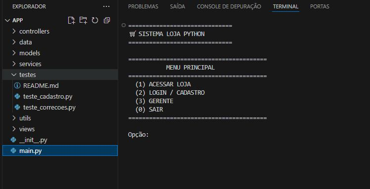
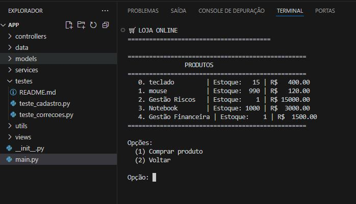
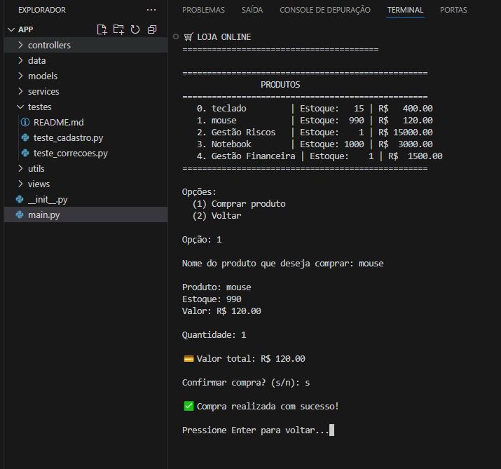

# 🛒 Sistema Loja Python - E-commerce CLI

## 📋 Sobre o Projeto

Sistema de loja virtual desenvolvido em Python com arquitetura MVC, simulando um e-commerce completo via interface de linha de comando (CLI). O projeto implementa fluxos de compra, gestão de estoque, autenticação de usuários e relatórios de vendas.

## 🏗️ Arquitetura e Estrutura

### Padrão MVC Implementado
```
Projeto Loja Python/
├── app/                          # Aplicação principal
│   ├── models/                   # Modelos de dados
│   │   ├── produto.py           # Entidade Produto
│   │   ├── cliente.py           # Entidade Cliente  
│   │   └── usuario.py           # Entidade Usuário
│   ├── views/                    # Camada de apresentação
│   │   ├── menu_view.py         # Menus do sistema
│   │   └── produto_view.py      # Visualização de produtos
│   ├── controllers/              # Lógica de negócio
│   │   ├── produto_controller.py # Gestão de produtos
│   │   ├── auth_controller.py   # Autenticação e autorização
│   │   ├── cliente_controller.py # Gestão de clientes
│   │   └── venda_controller.py  # Gestão de vendas
│   ├── services/                 # Serviços auxiliares
│   │   ├── json_service.py      # Manipulação de arquivos JSON
│   │   └── validacao_service.py # Validação de entradas
│   └── utils/                    # Utilitários
│       └── helpers.py           # Funções auxiliares
├── data/                         # Dados persistentes
│   ├── Clientes/
│   │   └── cadastro_cliente.json
│   ├── Estoque/
│   │   ├── Produtos/
│   │   │   └── produtos.json
│   │   └── Vendas/
│   │       ├── vendas_dia.json
│   │       ├── vendas_semana.json
│   │       └── vendas_mes.json
│   └── log/
│       ├── log_cliente.json
│       └── login_gerente.json
└── README.md
```

## 🚀 Funcionalidades

### 👤 Módulo Cliente
- **✅ Navegação na Loja**: Visualização de catálogo de produtos
- **✅ Sistema de Compras**: Seleção e compra de produtos
- **✅ Autenticação**: Login e cadastro de clientes
- **✅ Carrinho de Compras**: Adição, edição e remoção de itens
- **✅ Checkout**: Finalização de pedidos com múltiplas formas de pagamento

### 🔧 Módulo Gerente
- **✅ Autenticação Segura**: Login com credenciais administrativas
- **✅ Gestão de Produtos**: Operações CRUD completas (Criar, Ler, Atualizar, Deletar)
- **✅ Controle de Estoque**: Atualização de quantidades e valores
- **✅ Relatórios de Vendas**: Visualização de vendas por período (dia, semana, mês)
- **✅ Painel Administrativo**: Interface dedicada para gestão

### 💾 Sistema de Dados
- **✅ Persistência JSON**: Armazenamento em arquivos locais
- **✅ Validação de Entradas**: Tratamento robusto de dados do usuário
- **✅ Backup Automático**: Salvamento automático das alterações

## 🛠️ Tecnologias e Padrões

- **Linguagem**: Python 3.8+
- **Arquitetura**: MVC (Model-View-Controller)
- **Persistência**: Arquivos JSON
- **Validação**: Entradas tipadas e validadas
- **Segurança**: Senhas mascaradas e autenticação
- **UI/UX**: Interface CLI intuitiva com feedback visual

## 📦 Módulos Principais

### Models (Modelos de Dados)
- `Produto`: nome, quantidade, valor
- `Cliente`: dados pessoais e endereço
- `Usuario`: credenciais de acesso

### Controllers (Lógica de Negócio)
- `ProdutoController`: Gestão completa do catálogo
- `AuthController`: Autenticação de clientes e gerentes
- `ClienteController`: Cadastro e gestão de clientes

### Views (Interface)
- `MenuView`: Menus navegacionais do sistema
- `ProdutoView`: Apresentação de produtos e estoque

### Services (Serviços)
- `JSONService`: Operações de leitura/gravação JSON
- `ValidacaoService`: Validação e sanitização de entradas

## 🎯 Como Executar

```bash

# 1
git clone https://github.com/Xavier-sa/loja_python.git

# 2
cd loja_python

# 3.
python app/main.py

# OU execute diretamente na pasta app:
cd loja_python/app
python main.py

```

## 🔐 Credenciais Padrão

**Gerente:**
- Email: `adm@loja.com`
- Senha: `adm123`

## 📊 Demonstração

### Tela Inicial


### Navegação Principal  


### Fluxo de Compra



## 👨‍💻 Desenvolvimento

O projeto segue boas práticas de desenvolvimento:
- Código modular e reutilizável

---

**Desenvolvido com Python e arquitetura MVC** 🐍🚀